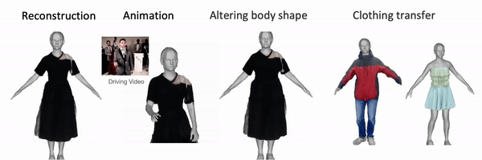
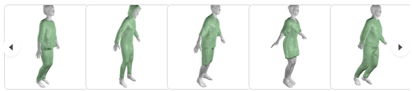
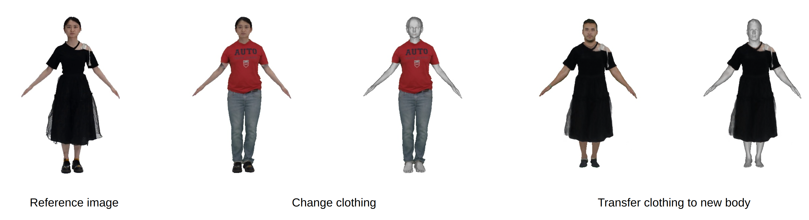

<!-- PROJECT LOGO -->

<p align="center">

  <h1 align="center">SCARF: Capturing and Animation of Body and Clothing from Monocular Video 
 </h1>
<!--  <p align="center">
    <a href="https://ps.is.tuebingen.mpg.de/person/yxiu"><strong>Yao Feng</strong></a>
    ·
    <a href="https://ps.is.tuebingen.mpg.de/person/jyang"><strong>Jinlong Yang</strong></a>
    ·
    <a href="https://ps.is.tuebingen.mpg.de/person/black"><strong>Michael J. Black</strong></a>
    .
    <a href="https://people.inf.ethz.ch/pomarc/"><strong>Marc Pollefeys</strong></a>
    .
    <a href="https://ps.is.mpg.de/person/tbolkart"><strong>Timo Bolkart</strong></a>
  </p>
  <h2 align="center">SIGGRAPH Asia 2022 conference </h2>
  -->
  <div align="center">
    
  </div>
</p> 

This is the Pytorch implementation of SCARF. More details please check our [Project](https://yfeng95.github.io/scarf/) page.

SCARF extracts a 3D clothed avatar from a monocular video.  
SCARF allows us to synthesize new views of the reconstructed avatar, and to animate the avatar with SMPL-X identity shape and pose control. 
The disentanglement of thebody and clothing further enables us to transfer clothing between subjects for virtual try-on applications. 

The key features:
1. animate the avatar by changing body poses (including hand articulation and facial expressions),  
2. synthesize novel views of the avatar, and  
3. transfer clothing between avatars for virtual try-on applications.   

SCARF's hybrid modeling approach enables these capabilities.

<br>

## Getting Started
Clone the repo:
  ```bash
  git clone https://github.com/yfeng95/SCARF
  cd SCARF
  ```  
### Requirements
```bash
conda create -n scarf python=3.9
conda activate scarf
pip install -r requirements.txt
``` 
If you have problems when installing [pytorch3d](https://github.com/facebookresearch/pytorch3d/blob/main/INSTALL.md), please follow their instructions.  
### Download data 
```
bash scripts/fetch_data.sh
```

## Visualization
check training frames: 
```bash
python main_demo.py --vis_type capture --frame_id 0 
```
**novel view** synthesis of given frame id: 
```bash
python main_demo.py --vis_type novel_view --frame_id 0 
```
extract **mesh** and visualize 
```bash
python main_demo.py --vis_type extract_mesh --frame_id 0
```
You can go to our [project](https://yfeng95.github.io/scarf/) page and play with the extracted meshes.   
<p align="center"> 

</p>

**animation**  
```bash 
python main_demo.py --vis_type animate
```

**clothing transfer**
```bash 
# apply clothing from other model 
python main_demo.py --vis_type novel_view --clothing_model_path exps/snapshot/male-3-casual
# transfer clothing to new body
python main_demo.py --vis_type novel_view --body_model_path exps/snapshot/male-3-casual
```
<p align="center"> 

</p>


More data and trained models can be found [here](https://nextcloud.tuebingen.mpg.de/index.php/s/3SEwJmZcfY5LnnN), you can download and put them into `./exps`.

## Training 
training with SCARF video example
```bash
python main_train.py --data_cfg configs/data/mpiis/DSC_7147.yml 
```
training with other videos  
check [here](./process_data/README.md) to **prepare data with your own videos**, then run  
```bash
python main_train.py --data_cfg [data config file]  
```

## TODO
- [ ] add more processed data and trained models
- [ ] code for refining the pose of trained models

## Citation
```bibtex
@inproceedings{Feng2022scarf,
    author = {Feng, Yao and Yang, Jinlong and Pollefeys, Marc and Black, Michael J. and Bolkart, Timo},
    title = {Capturing and Animation of Body and Clothing from Monocular Video},
    year = {2022},
    booktitle = {SIGGRAPH Asia 2022 Conference Papers},
    articleno = {45},
    numpages = {9},
    location = {Daegu, Republic of Korea},
    series = {SA '22}
} 
```

## Acknowledgments
We thank [Sergey Prokudin](https://ps.is.mpg.de/people/sprokudin), [Weiyang Liu](https://wyliu.com), [Yuliang Xiu](https://xiuyuliang.cn/), [Songyou Peng](https://pengsongyou.github.io/), [Qianli Ma](https://qianlim.github.io/) for fruitful discussions, and PS members for proofreading. We also thank Betty
Mohler, Tsvetelina Alexiadis, Claudia Gallatz, and Andres Camilo Mendoza Patino for their supports with data. 

Special thanks to [Boyi Jiang](https://scholar.google.com/citations?user=lTlZV8wAAAAJ&hl=zh-CN) and [Sida Peng](https://pengsida.net/) for sharing their data.

Here are some great resources we benefit from:
- [FasterRCNN](https://pytorch.org/vision/main/models/faster_rcnn.html) for detection
- [RobustVideoMatting](https://github.com/PeterL1n/RobustVideoMatting) for background segmentation
- [cloth-segmentation](https://github.com/levindabhi/cloth-segmentation) for clothing segmentation
- [PIXIE](https://github.com/yfeng95/PIXIE) for SMPL-X parameters estimation  
- [smplx](https://github.com/vchoutas/smplx) for body models 
- [PyTorch3D](https://github.com/facebookresearch/pytorch3d) for Differential Rendering

Some functions are based on other repositories, we acknowledge the origin individually in each file.

<br>

--------------

<br>

## License

This code and model are available for non-commercial scientific research purposes as defined in the [LICENSE](LICENSE) file. By downloading and using the code and model you agree to the terms in the [LICENSE](LICENSE).

## Disclosure
MJB has received research gift funds from Adobe, Intel, Nvidia, Meta/Facebook, and Amazon. MJB has financial interests in Amazon, Datagen Technologies, and Meshcapade GmbH. While MJB is a part-time employee of Meshcapade, his research was performed solely at, and funded solely by, the Max Planck Society.
While TB is part-time employee of Amazon, this research was performed
solely at, and funded solely by, MPI.

## Contact
For more questions, please contact yao.feng@tue.mpg.de
For commercial licensing, please contact ps-licensing@tue.mpg.de 