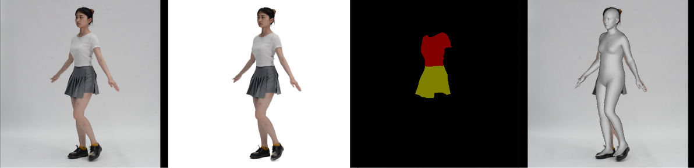

<!-- PROJECT LOGO -->

<p align="center">

  <h1 align="center">SCARF: Capturing and Animation of Body and Clothing from Monocular Video 
 </h1>
<!--  <p align="center">
    <a href="https://ps.is.tuebingen.mpg.de/person/yxiu"><strong>Yao Feng</strong></a>
    ·
    <a href="https://ps.is.tuebingen.mpg.de/person/jyang"><strong>Jinlong Yang</strong></a>
    ·
    <a href="https://ps.is.tuebingen.mpg.de/person/black"><strong>Michael J. Black</strong></a>
    .
    <a href="https://people.inf.ethz.ch/pomarc/"><strong>Marc Pollefeys</strong></a>
    .
    <a href="https://ps.is.mpg.de/person/tbolkart"><strong>Timo Bolkart</strong></a>
  </p>
  <h2 align="center">SIGGRAPH Asia 2022 conference </h2>
  -->
  <div align="center">
    
     <h5 align="center">cropped image, subject segmentation, clothing segmentation, SMPL-X estimation </h5>
  </div>
</p> 
This is the script to process video data for SCARF training. 

## Getting Started
### Environment 
SCARF needs input image, subject mask, clothing mask, and inital SMPL-X estimation for training. 
Specificly, we use
* [FasterRCNN](https://pytorch.org/vision/main/models/faster_rcnn.html) to detect the subject and crop image 
* [RobustVideoMatting](https://github.com/PeterL1n/RobustVideoMatting) to remove background
* [cloth-segmentation](https://github.com/levindabhi/cloth-segmentation) to segment clothing 
* [PIXIE](https://github.com/yfeng95/PIXIE) to estimate SMPL-X parameters 

When using the processing script, it is necessary to agree to the terms of their licenses and properly cite them in your work. 

1. Clone submodule repositories:
```
git submodule update --init --recursive
```
2. Download their needed data:
```bash
bash fetch_asset_data.sh
```
If the script failed, please check their websites and download the models manually. 

### process video data
Put your data list into ./lists/subject_list.txt, it can be video path or image folders.   
Then run
```bash
python process_video.py --crop --ignore_existing
```
Processing time depends on the number of frames and the size of video, for mpiis-scarf video (with 400 frames and resolution 1028x1920), need around 12min. 


## Video Data
The script has been verified to work for datasets:
``` 
a. mpiis-scarf (recorded video for this paper)
b. People Snapshot Dataset (https://graphics.tu-bs.de/people-snapshot)
c. SelfRecon dataset (https://jby1993.github.io/SelfRecon/)
d. iPER dataset (https://svip-lab.github.io/dataset/iPER_dataset.html)
``` 
To get the optimal results for your customized video, it is recommended to capture the video using similar settings as the datasets mentioned above. 

This means keeping the camera static, 
recording the subject with more views, and using uniform lighting. And better to have less than 1000 frames for training. 
For more information, please refer to the limitations section of SCARF. 